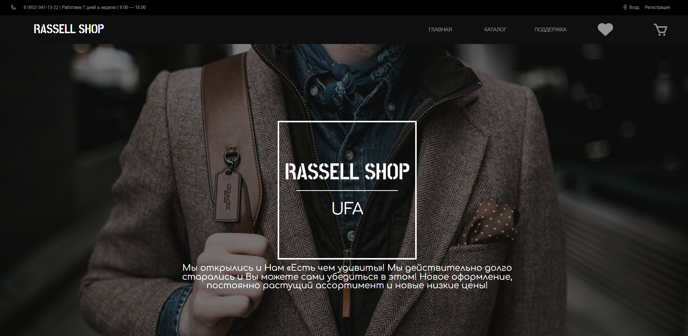

# Проект: адаптивный интернет магазин RassellShop.

### [ Ссылка на проект ](https://rassellek.github.io/4p22-final-project-ruslan-nurgaleev/)

### Цель и задачи проекта:

Реализовано веб-приложение (сайт), содержащее следующие страницы:

<ul>
<li>Главная страница со списком товаров (карточек), содержащих изображение, заголовок, описание и кнопку действия, реализующую механизм добавления или исключения товара из списка покупок. Реализация поиска товаров по наименованию и категории.</li>
<li>Страница товара – содержащая фотографию, название и описание товара, а также содержащая кнопку действия.</li>
<li>Страница корзины – содержащая список товаров (карточек) с изображение и наименованием товара, а также предоставляющая возможность управления списком приобретаемого товара.</li>
<li>Страница обратной связи предоставляющая возможности создания  сообщения для службы поддержки.</li>
</ul>

### Дополнительные возможности реализованные в проекте:

<ul>
<li>Реализация механизма управления количеством приобретаемого товара и контроля количества и стоимости приобретаемого товара.</li>
<li>Использование Redux и localStorage для хранения данных приложения.</li>
</ul>

 

### Данный проект создавался на стеке:

 

### Используемые программы:

